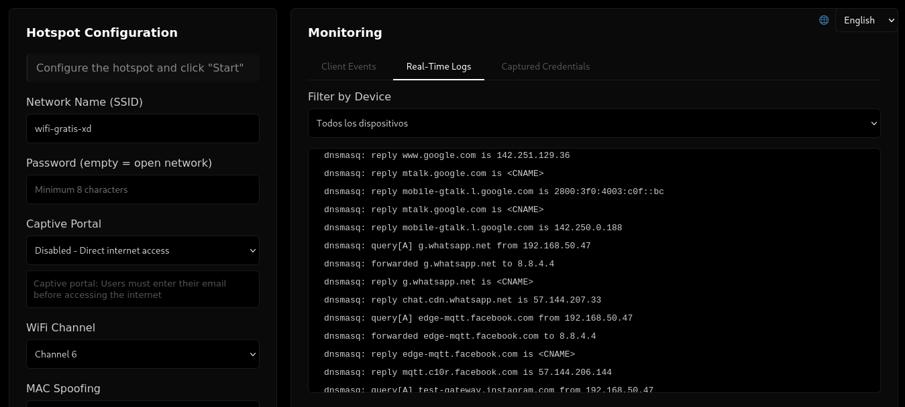

# Wifi-osint-toolkit - OSINT + DNS Spoofing + Captive Portal



Advanced tool for creating a WiFi hotspot with OSINT monitoring capabilities, DNS Spoofing, and educational captive portal. Designed for pentesting and security demonstrations.

## Main Features

- **Configurable WiFi Hotspot**: Customizable access point with WPA2/WPA3 or open networks
- **OSINT Monitoring**: Real-time network traffic capture, DNS/HTTP logging, device analysis
- **DNS Spoofing**: Domain redirection with fake pages for demonstrations
- **Captive Portal**: Web authentication portal with credential capture
- **WPA Handshake Capture**: Automatic 4-way handshake detection and capture
- **Web Control Panel**: Modern interface with real-time monitoring at `http://localhost:5000`

## System Requirements

### Operating System
- Linux (Kali Linux recommended)
- Debian/Ubuntu and derivatives

### System Dependencies

Install all dependencies with a single command:

```bash
sudo apt-get update
sudo apt-get install -y hostapd dnsmasq tcpdump tshark iptables expect python3-flask python3-flask-socketio
```

**Description of each package:**

- **hostapd**: Software for creating WiFi access points
- **dnsmasq**: DHCP and DNS server
- **tcpdump**: Network packet capture
- **tshark**: Traffic analysis tool (Wireshark CLI)
- **iptables**: Linux firewall and NAT
- **expect**: Interactive script automation
- **python3-flask**: Python web framework
- **python3-flask-socketio**: Real-time WebSocket communication

### Required Hardware
- WiFi adapter with AP (Access Point) mode capability
- Internet connection (for NAT and upstream access)

## Installation

1. **Navigate to project directory**
```bash
cd /path/to/project
```

2. **Install dependencies**
```bash
sudo apt-get update
sudo apt-get install -y hostapd dnsmasq tcpdump tshark iptables expect python3-flask python3-flask-socketio
```

3. **Verify network interfaces**
```bash
ip link show
# Identify your WiFi interface (e.g., wlan0, wlan1)
```

4. **Grant execution permissions**
```bash
chmod +x wifi_hotspot_osint.sh
chmod +x spoof_functions.sh
```

## Usage

### Web Panel (Recommended)

1. Start the web control panel:
```bash
sudo python3 hotspot_control_web.py
```

2. Access the panel at `http://localhost:5000`
3. Configure hotspot options and click "Start Hotspot"

### Command Line

```bash
sudo ./wifi_hotspot_osint.sh
```

Follow the interactive menu to configure and start the hotspot.

## Basic Configuration

- **SSID**: WiFi network name
- **Password**: Leave empty for open network, minimum 8 characters for WPA2
- **Channel**: WiFi channel (1-11 for 2.4GHz, recommended: 6)
- **Portal**: Enable/disable captive portal
- **MAC Spoofing**: Random, custom, or disabled

## File Structure

```
project/
├── wifi_hotspot_osint.sh          # Main script
├── spoof_functions.sh             # DNS Spoofing functions
├── hotspot_control_web.py         # Web control panel
├── webcautivo/                    # Captive portal templates
├── logs/                          # Auto-generated logs
│   ├── traffic_YYYYMMDD.pcap      # Network captures
│   ├── dns_queries_YYYYMMDD.log   # DNS logs
│   ├── captive_credentials.txt    # Captured credentials
│   └── handshake_*.cap            # WPA handshakes
└── README.md
```

## Security Considerations

**EDUCATIONAL USE ONLY**

This tool is designed exclusively for:
- Controlled testing environments
- Educational security demonstrations
- Authorized pentesting
- Computer security research

**LEGAL WARNINGS**

- DO NOT use without explicit authorization
- DO NOT capture real credentials without consent
- DO NOT intercept private communications
- DO NOT use on public or third-party networks
- Misuse can be ILLEGAL and result in penalties

## Stopping the Hotspot

From web panel: Click "Stop Hotspot"

From terminal:
```bash
# Press Ctrl + C or:
sudo killall hostapd dnsmasq tcpdump
sudo iptables -F
sudo iptables -t nat -F
```

## License

**EDUCATIONAL AND RESEARCH USE ONLY**

This tool is provided "as is" without warranties. The author is not responsible for misuse or illegal use of this software.

**IMPORTANT:** Always obtain explicit authorization before conducting any security testing.
